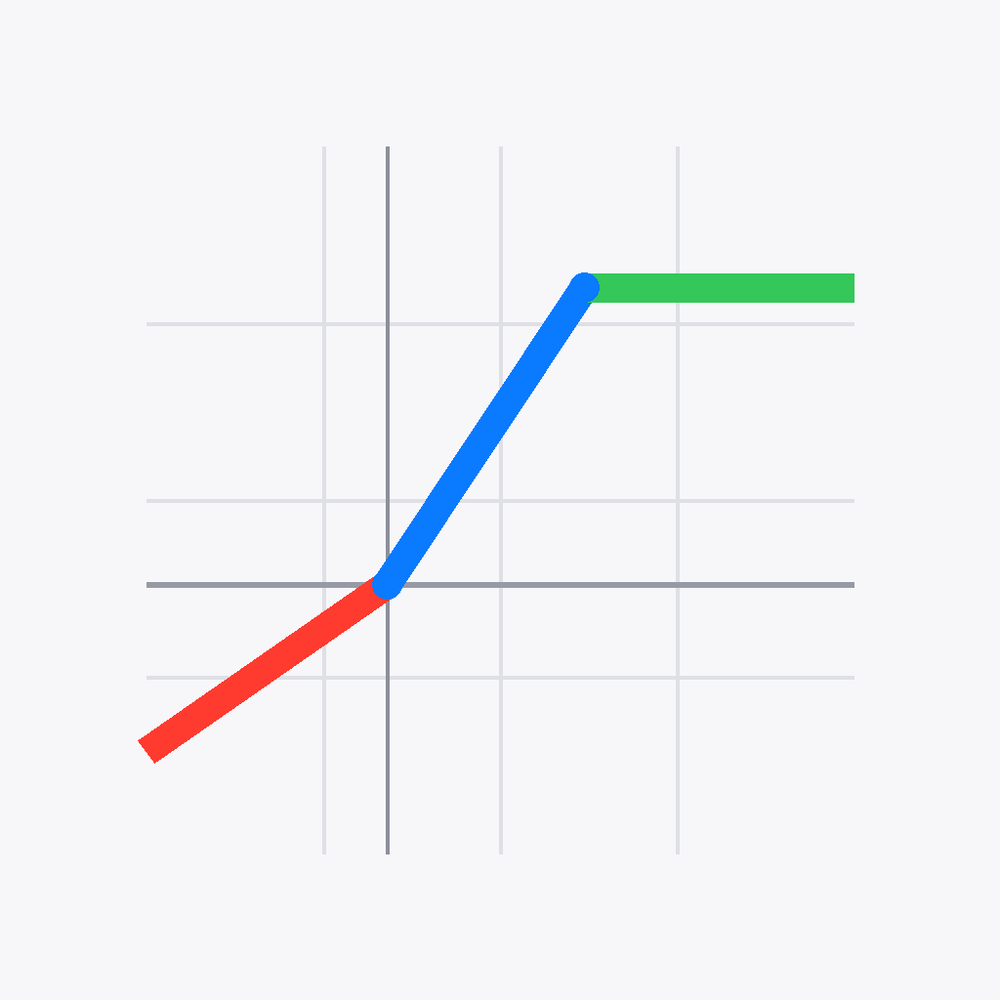
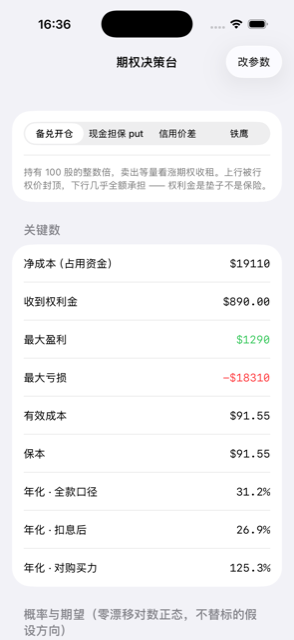
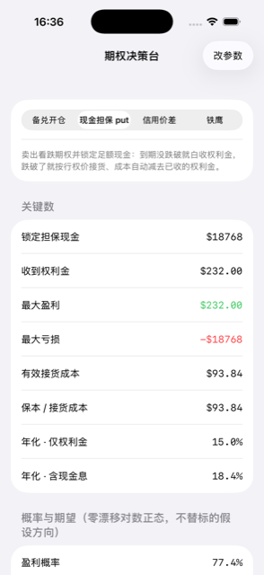
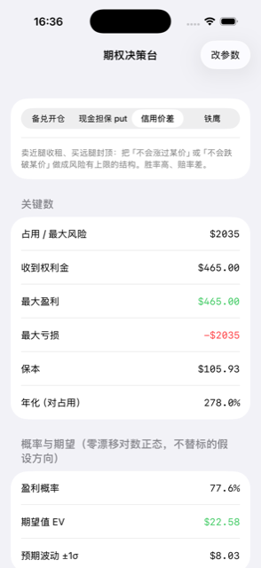
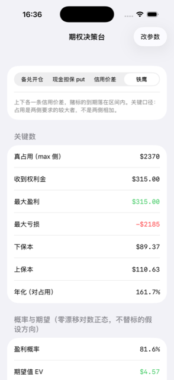

<p align="center"></p>

# 期权决策台 · options-calc

**开仓前 30 秒，算清这一单的盈亏、真占用和年化。**

    

整个舰队的第一个 app。立项那天的目标只有一句：「不办 $99，能不能把 Swift 跑到 iPhone 上」。算式从网页版逐行移植，8 用例 397 个数值 + 83 段文案两侧逐字对账，靠这道门抓过整数截断和千分位两个真 bug。

<table><tr>
<td align="center" width="25%"><br><sub>备兑开仓：净成本、最大盈亏、三个口径的年化一屏见底</sub></td>
<td align="center" width="25%"><br><sub>现金担保 put：锁定担保、有效接货成本、含现金息的年化</sub></td>
<td align="center" width="25%"><br><sub>信用价差：占用即最大风险，盈利概率与期望值同屏</sub></td>
<td align="center" width="25%"><br><sub>铁鹰：真占用按 max 侧算，不是两侧相加</sub></td>
</tr></table>

<details><summary>更多截图</summary><table><tr>
<td align="center" width="25%"><br><sub>装在主屏上——纯离线，飞行模式照样算</sub></td>
</tr></table></details>

## 它做什么

| 功能 | 说明 |
|---|---|
| **四种卖方结构，一屏见底** | 备兑开仓、现金担保 put、信用价差、铁鹰——每种结构给出净成本、收到权利金、最大盈亏、保本点。参数改一处，全部数字实时重算。 |
| **年化分口径，不给一个笼统数** | 仅权利金、含现金息、对占用——同一单给三个口径的年化并排放着。混着报年化是这类计算器最常见的骗法，这里把口径写在每个数字旁边。 |
| **概率与期望值，假设写在标题里** | 盈利概率、期望值 EV、±1σ 预期波动，全部标明「零漂移对数正态、不替标的假设方向」——模型的前提不藏在文档里，就印在数字上方。 |
| **纯函数，零网络零凭证** | 算式从网页版逐行移植，两侧共读同一份回归用例（397 个数值 + 83 段文案逐字对）。没有后端、不要账号，是整个舰队里最稳的一个。 |

## 怎么拿到

TestFlight 内测中，暂未开放公开链接。

纯离线，不依赖任何后端；clone 下来就能在模拟器上跑。

## 构建

```bash
brew install xcodegen
xcodegen generate
xcodebuild -scheme OptionsSpike -destination 'generic/platform=iOS Simulator' build
```

- 仓里的 `*.sh` 是作者本机舰队脚本的 shim（三平台构建 / 真机装机 / TestFlight），依赖 `~/Dev` 下的总部工具，不在本仓；没有那套工具时它们会明确退出。
- `Shared/PlatformCompat.swift` 是总部共享文件的逐字节副本（iOS-only SwiftUI 修饰符在 macOS 侧的同名 no-op），别在这里改它。

开发细节（回归、验证通道、约束）见 [DEVELOPING.md](DEVELOPING.md)。

## 相关

- 产品页：<https://apps.tianli.cyou/p/options-calc-ios.html>
- 舰队总览（10 个 app 怎么来的）：<https://apps.tianli.cyou/ios.html>
- 教程：[从零到 TestFlight：一个人做 iPhone app 的完整路径](https://blog-ai.tianli.cyou/nine-ios-apps-in-two-weeks)

## License

MIT © 2026 曾田力 (Tianli Zeng)
